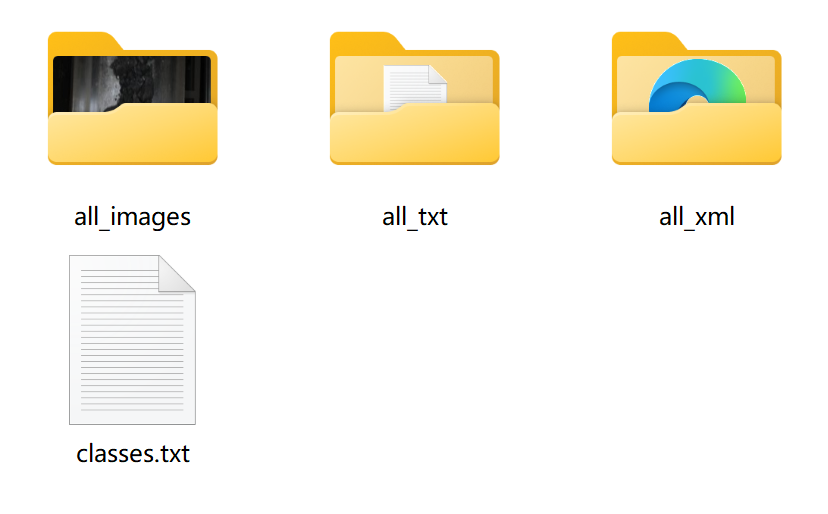
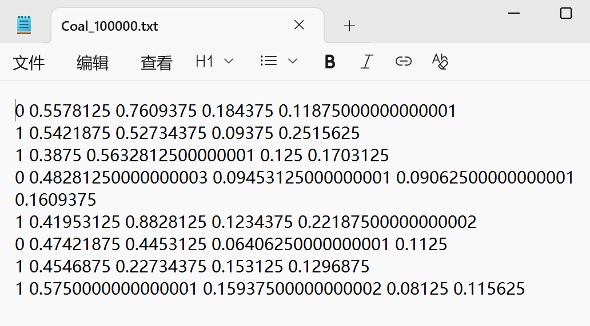
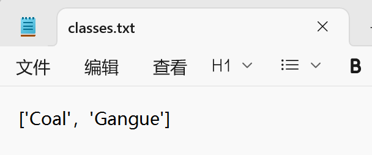
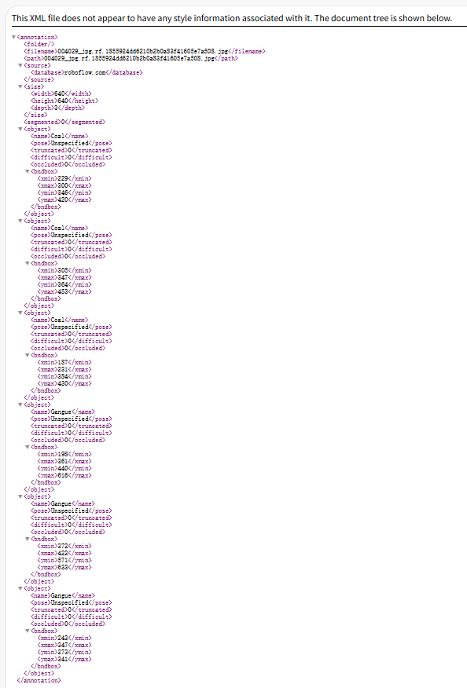
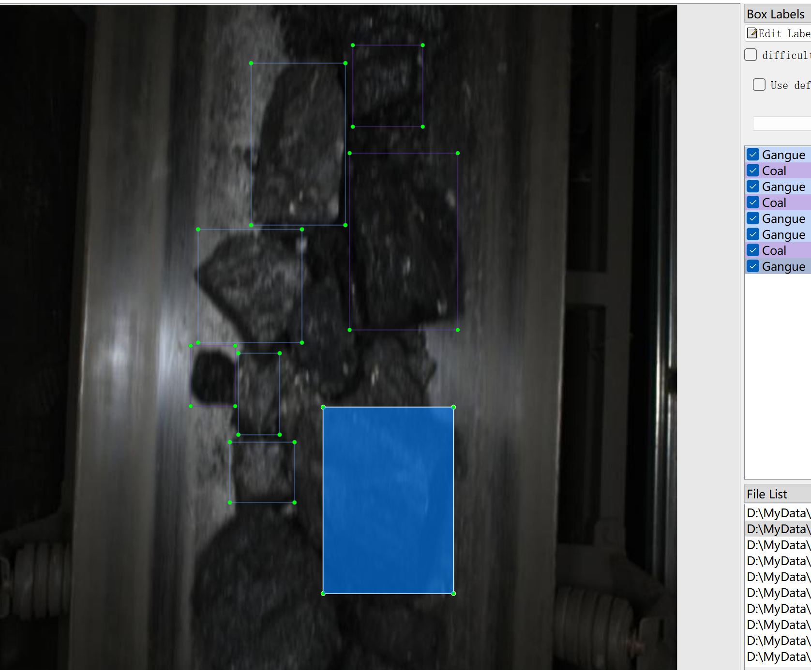

# Coal Gangue Detection Dataset: Object Detection Dataset

Dataset Information: There are a total of 7,342 images and corresponding annotation files. The annotation files are provided in two formats, including the VOC formatted XML file and the YOLO formatted txt file.

Annotation Objects:
['Coal', 'Gangue']

Note: An image may contain multiple objects, so the total number of annotation boxes might be greater than the number of images.

The complete dataset consists of three folders and one txt file:
- all_txt folder and classes.txt: Store the YOLO formatted txt annotation files, with the same number as the images, each annotation file corresponds to one image.
- classes.txt:
- all_xml file: The VOC formatted xml annotation file. The number is the same as the images, each annotation file corresponds to one image.

For detailed understanding of the VOC format standards, please refer to your search results.
Both formats can be used, choose one according to your needs.

Annotation Screenshot:

## Images

Here is a pay link on Stripe ( https://buy.stripe.com/3cs8yP7sY87d0vu9AB ). Please contact me lonlonago@foxmail.com after funding $89, and I will send you a complete data files , thank you!

